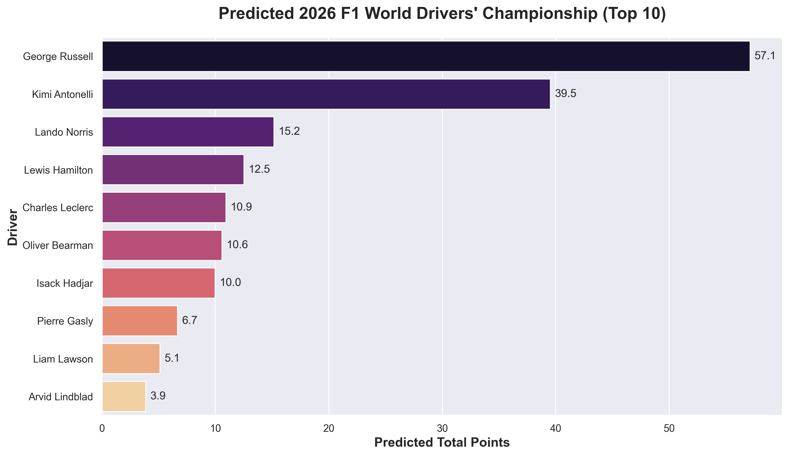

# 🏎️ F1 2026 Season Predictor: Machine Learning Meets Video Game Stats


## 📌 Project Overview
This project utilizes machine learning to predict the outcome of the **2026 Formula 1 World Championship**. 

Unlike traditional predictive models that rely strictly on historical real-world telemetry and race results, this project takes a novel approach by merging over a decade of real-world F1 race data (2013–2025) with **EA Sports F1 Video Game Driver Ratings**. By quantifying abstract driver traits like *Racecraft*, *Awareness*, and *Pace*, the model uncovers unique performance correlations to predict future championship standings.

## 🏆 2026 Championship Predictions
Our XGBoost model predicts massive dominance from Mercedes in the 2026 era. 

**Predicted Drivers' Form (Top 10):**


**Predicted World Drivers' Championship (Top 5):**
1. 🇬🇧 George Russell (57.1 pts)
2. 🇮🇹 Kimi Antonelli (39.5 pts)
3. 🇬🇧 Lando Norris (15.2 pts)
4. 🇬🇧 Lewis Hamilton (12.5 pts)
5. 🇲🇨 Charles Leclerc (10.9 pts)

**Predicted Constructors' Championship (Top 3):**
1. Mercedes (96.7 pts)
2. Ferrari (23.4 pts)
3. McLaren Mercedes (17.3 pts)

*(Note: Points are scaled based on the model's regressive output averages across the simulated season).*

## 🧠 Methodology
1. **Data Ingestion:** Automatically crawls, standardizes, and merges disparate `.csv` files spanning multiple years of real-world results and video game patch updates.
2. **Entity Resolution & Preprocessing:** Normalizes driver names across datasets, averages multi-patch game ratings into single-season metrics, and imputes missing game data for substitute/unrated drivers using grid averages.
3. **Feature Engineering:** Calculates critical momentum metrics, including:
   - `Driver_Season_Avg_Points`: Measuring current driver form.
   - `Team_Season_Avg_Points`: Measuring constructor strength.
   - `Career_Races_Logged`: Measuring cumulative grid experience.
4. **Model Training:** Utilizes a CUDA-accelerated **XGBoost Regressor**. The model uses a chronological split—training on 2013–2023 data and validating against the 2024 season to ensure accuracy before predicting the unseen 2026 grid.

## 📂 Project Structure
```text
f1-race-prediction/
│
├── datasets/
│   ├── raw/               # Original F1 CSVs (Race results + Game ratings)
│   └── processed/         # Cleaned, merged, and ML-ready master files
│
├── src/
│   ├── data_ingestion.py      # Standardizes and merges raw files
│   ├── preprocess.py          # Handles missing values and entity resolution
│   ├── feature_engineering.py # Generates momentum and experience features
│   ├── model_training.py      # XGBoost training script (CUDA supported)
│   └── predict_2026.py        # Generates final WDC and WCC standings
│
├── models/                # Saved .pkl models
├── notebooks/             # Jupyter notebooks for EDA and correlation mapping
└── outputs/               # Final prediction CSVs and visualizations
```

## 🚀 Installation & Usage
1. **Clone the repository:** `git clone [https://github.com/York-Lucis/f1-race-prediction.git](https://github.com/York-Lucis/f1-race-prediction.git)`
2. **Change to directory:** `cd f1-race-prediction`
3. **Install dependencies:** `pip install -r requirements.txt`
4. **Run the pipeline sequentially:** `python src/data_ingestion.py && python src/preprocess.py && python src/feature_engineering.py && python src/model_training.py && python src/predict_2026.py`
